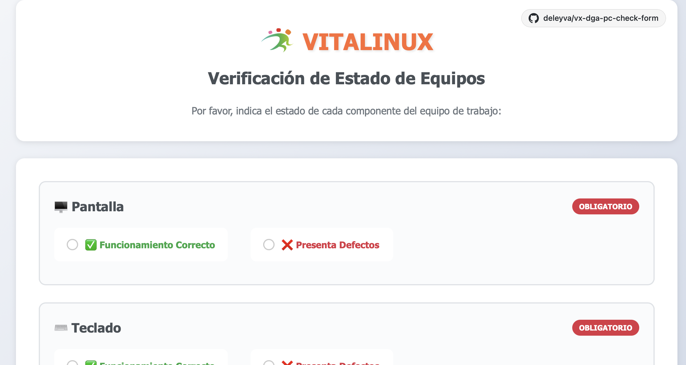

# Comprobación de PC Vitalinux

Aplicación de escritorio para verificar el estado de equipos de trabajo en VitaLinux, desarrollada con **Tauri** (Rust + Web).



## Características

-   Formulario intuitivo de verificación de componentes
-   Exportación automática de informes en formato JSON
-   Diseño responsive adaptado a cualquier pantalla
-   Rendimiento nativo gracias a Tauri
-   Autostart al inicio de sesión en VitaLinux

## Componentes Verificables

-   **Pantalla** (Obligatorio)
-   **Teclado** (Obligatorio)
-   **Ratón** (Opcional)
-   **Batería** (Opcional)
-   **Otros** (Opcional)

## Instalación en VitaLinux/Ubuntu

Descarga el paquete `.deb` desde la [página de Releases](https://github.com/deleyva/vx-dga-pc-check-form/releases/latest) e instálalo:

```bash
sudo dpkg -i vx-dga-pc-check-form_<VERSION>_amd64.deb
sudo apt install -f  # Instalar dependencias si es necesario
```

La aplicación se iniciará automáticamente al hacer login gracias al fichero `.desktop` instalado en `/etc/xdg/autostart/`.

### Dependencias del Sistema

```bash
sudo apt install libwebkit2gtk-4.0-37 libgtk-3-0
```

## Releases automáticos (CI/CD)

El proyecto usa GitHub Actions para generar releases automáticamente.

### Crear un nuevo release

Usa el comando `just release <version>` para automatizar el proceso:

```bash
just release 1.0.21
```

O sigue los pasos manualmente:

```bash
# 1. Bump versión en package.json + package-lock.json
npm version 1.0.21 --no-git-tag-version

# 2. Bump versión en tauri.conf.json (npm no lo toca)
sed -i 's/"version": "1.0.16"/"version": "1.0.21"/' src-tauri/tauri.conf.json

# 3. Commit, tag y push
git add package.json package-lock.json src-tauri/tauri.conf.json
git commit -m "Bump version to v1.0.21"
git tag v1.0.21
git push && git push origin v1.0.21
```

GitHub Actions construye el `.deb` y crea el release con la versión correcta.

> **Importante:** La versión en `package.json` y `tauri.conf.json` debe coincidir con el tag. Si no, el título del release no coincidirá con el tag.

Alternativamente puedes usar `./release.sh` que automatiza todo el proceso (bump, build, tag, push).

## Desarrollo

```bash
# Instalar dependencias
npm install

# Ejecutar en modo desarrollo
npm run dev

# Construir para producción
npm run build
```

## Estructura del JSON enviado

El formulario (`script.js`) construye `timestamp`, `verificacion_equipos` y
`resumen`. El backend en Rust (`src-tauri/src/main.rs`) añade tres campos más
antes de enviarlo, ejecutando comandos del sistema:

| Campo | De dónde sale |
|---|---|
| `migasfree_cid` | `/usr/bin/migasfree-cid` |
| `usuario_grafico` | `vx-usuario-grafico` |
| `etiquetas` | `vx-migasfree-tags -g` |

Ninguno de los tres usa `sudo`. Si alguno falla, el informe se envía igual con
ese campo vacío: reportar el estado del equipo importa más que el dato que falte.

```json
{
  "timestamp": "2026-09-05T10:30:00.000Z",
  "migasfree_cid": "12345",
  "usuario_grafico": "jgarcia",
  "etiquetas": "aula-musica planta-1",
  "verificacion_equipos": {
    "pantalla": {
      "estado": "correcto|defectuoso|no_verificado",
      "problema": "descripción del problema",
      "obligatorio": true
    }
  },
  "resumen": {
    "total_componentes": 5,
    "componentes_obligatorios": 2,
    "componentes_opcionales": 3,
    "componentes_verificados": 5,
    "componentes_correctos": 4,
    "componentes_defectuosos": 1,
    "equipo_operativo": false,
    "requiere_atencion": true
  }
}
```

El servidor que lo recibe es [vx-registro-de-uso](https://github.com/deleyva/vx-registro-de-uso).
Almacena estos campos y descarta en silencio cualquier otro, así que las
versiones antiguas de esta aplicación siguen funcionando sin cambios.

## Configuración de la API

### Variable de Entorno VX_API_URL

La variable VX_API_URL viene configurada por defecto al instalar la aplicación con el valor \`<http://servidor.vx:3001/v1/report>.

Se puede sobrescribir con una variable de entorno `VX_API_URL` en el sistema.

Para un usuario concreto:

```bash
VX_API_URL="http://servidor.vx:3001/v1/report" vx-dga-pc-check-form
```

Para configurarlo de forma permanente para **todos los usuarios del sistema**:

```bash
# Crear fichero de entorno global
sudo tee /etc/environment.d/vx-dga-pc-check-form.conf << 'EOF'
VX_API_URL="http://servidor.vx:3001/v1/report"
EOF
```

> Los usuarios necesitan cerrar sesión y volver a entrar para que surta efecto.

Alternativa con `/etc/environment` (compatible con sistemas sin `environment.d`):

```bash
# Añadir al final de /etc/environment
echo 'VX_API_URL="http://servidor.vx:3001/v1/report"' | sudo tee -a /etc/environment
```

### Modo Dry-Run (Testing)

```bash
vx-dga-pc-check-form --dry-run
```

## Comandos del Sistema

Los tres que ejecuta la aplicación al enviar un informe. Ninguno necesita
`sudo`; para depurar un equipo, ejecútalos a mano tal cual:

```bash
migasfree-cid           # identificador del equipo
vx-usuario-grafico      # usuario con sesión gráfica
vx-migasfree-tags -g    # etiquetas del equipo
```

Si `vx-migasfree-tags` no está instalado en un equipo, sus informes llegarán
sin etiquetas y la columna correspondiente del panel saldrá vacía. El resto
del informe se envía con normalidad.
